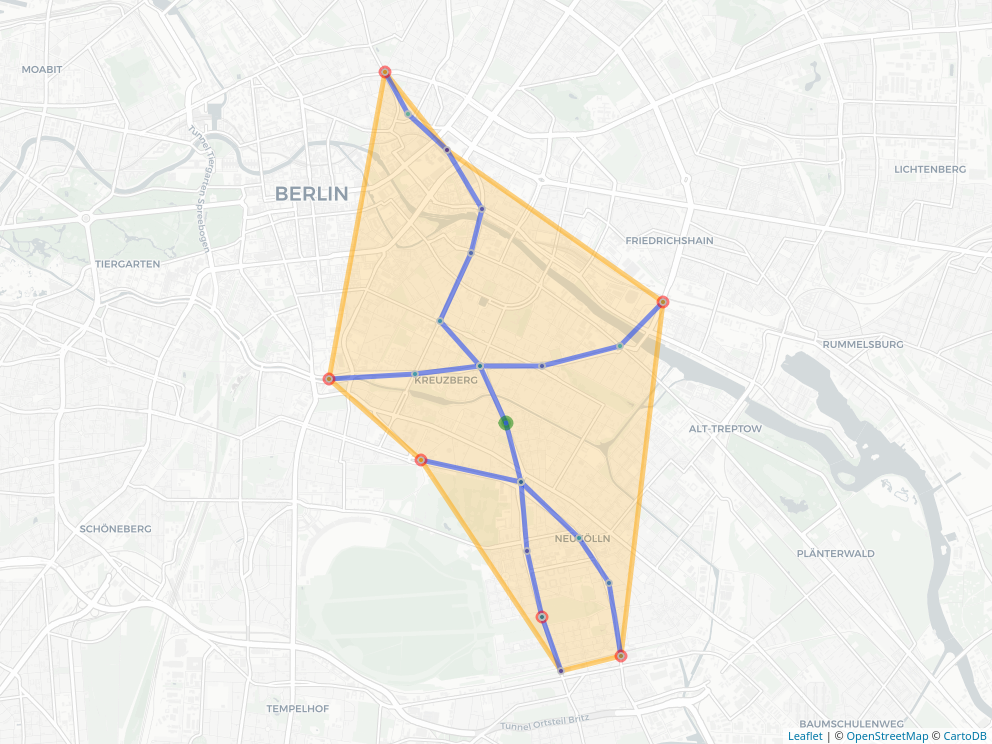

[](https://travis-ci.org/ATFutures/gtfs-router)
[](https://ci.appveyor.com/project/ATFutures/gtfs-router)
[](https://codecov.io/gh/ATFutures/gtfs-router)
[](https://www.repostatus.org/#wip)

# GTFS Router

**R** package for routing with [GTFS (General Transit Feed
Specification)](https://developers.google.com/transit/gtfs/) data.

## Installation

To install:

``` r
remotes::install_github("atfutures/gtfs-router")
```

To load the package and check the version:

``` r
library(gtfsrouter)
packageVersion("gtfsrouter")
```

    ## [1] '0.0.1'

## Main functions

The main functions can be demonstrated with sample data from Berlin (the
Verkehrverbund Berlin Brandenburg, or VBB), included with the package.
GTFS data are always stored as `.zip` files, and these sample data can
be written to local storage with the function `berlin_gtfs_to_zip()`.

``` r
berlin_gtfs_to_zip()
tempfiles <- list.files (tempdir (), full.names = TRUE)
filename <- tempfiles [grep ("vbb.zip", tempfiles)]
filename
```

    ## [1] "/tmp/RtmpKygzfZ/vbb.zip"

For normal package use, `filename` will specify the name of the local
GTFS data stored as a single `.zip` file.

### gtfs\_route

Given the name of a GTFS `.zip` file, `filename`, routing is as simple
as the following code:

``` r
gtfs <- extract_gtfs (filename)
gtfs <- gtfs_timetable (gtfs) # A pre-processing step to speed up queries
gtfs_route (gtfs,
            from = "Schonlein",
            to = "Berlin Hauptbahnhof",
            start_time = 12 * 3600 + 120) # 12:02 in seconds
```

    ## Day not specified; extracting timetable for Tuesday

|    | route     | stop                            | departure\_time | arrival\_time |
| -- | :-------- | :------------------------------ | :-------------- | :------------ |
| 6  | 106146288 | U Schonleinstr. (Berlin)        | 12:04:00        | 12:04:00      |
| 7  | 106146288 | U Kottbusser Tor (Berlin)       | 12:06:00        | 12:06:00      |
| 8  | 106146288 | U Moritzplatz (Berlin)          | 12:08:00        | 12:08:00      |
| 9  | 106146288 | U Heinrich-Heine-Str. (Berlin)  | 12:09:30        | 12:09:30      |
| 10 | 106146288 | S+U Jannowitzbrucke (Berlin)    | 12:10:30        | 12:10:30      |
| 1  | 103661178 | S+U Jannowitzbrucke (Berlin)    | 12:15:54        | 12:15:24      |
| 2  | 103661178 | S+U Alexanderplatz Bhf (Berlin) | 12:18:12        | 12:17:24      |
| 3  | 103661178 | S Hackescher Markt (Berlin)     | 12:19:54        | 12:19:24      |
| 4  | 103661178 | S+U Friedrichstr. Bhf (Berlin)  | 12:22:12        | 12:21:24      |
| 5  | 103661178 | S+U Berlin Hauptbahnhof         | 12:24:42        | 12:24:06      |

A routing query on a very large network (the GTFS data are MB) takes
only around 0.04 seconds.

### gtfs\_isochrone

Isochrones from a nominated station can be extracted with the
`gtfs_isochrone()` function, returning a list of all stations reachable
within a specified time period from that station.

``` r
gtfs <- extract_gtfs (filename)
gtfs <- gtfs_timetable (gtfs) # A pre-processing step to speed up queries
```

    ## Day not specified; extracting timetable for Tuesday

``` r
x <- gtfs_isochrone (gtfs,
                     from = "Schonlein",
                     start_time = 12 * 3600 + 120,
                     end_time = 12 * 3600 + 720) # 10 minutes later
```

    ## Loading required namespace: geodist

    ## Linking to GEOS 3.7.1, GDAL 2.3.2, PROJ 5.2.0

``` r
x
```

    ## $start_point
    ## Simple feature collection with 1 feature and 1 field
    ## geometry type:  POINT
    ## dimension:      XY
    ## bbox:           xmin: 13.42224 ymin: 52.49318 xmax: 13.42224 ymax: 52.49318
    ## epsg (SRID):    4326
    ## proj4string:    +proj=longlat +datum=WGS84 +no_defs
    ##                  stop_name                  geometry
    ## 1 U Schonleinstr. (Berlin) POINT (13.42224 52.49318)
    ## 
    ## $mid_points
    ## Simple feature collection with 15 features and 1 field
    ## geometry type:  POINT
    ## dimension:      XY
    ## bbox:           xmin: 13.40653 ymin: 52.47287 xmax: 13.43481 ymax: 52.5155
    ## epsg (SRID):    4326
    ## proj4string:    +proj=longlat +datum=WGS84 +no_defs
    ## First 10 features:
    ##                      stop_name                  geometry
    ## 1      U Hermannplatz (Berlin) POINT (13.42472 52.48696)
    ## 2      U Hermannplatz (Berlin) POINT (13.42472 52.48696)
    ## 3  U Rathaus Neukolln (Berlin) POINT (13.43481 52.48115)
    ## 4    U Kottbusser Tor (Berlin) POINT (13.41775 52.49905)
    ## 5    U Kottbusser Tor (Berlin) POINT (13.41775 52.49905)
    ## 6      U Hermannplatz (Berlin) POINT (13.42472 52.48696)
    ## 7        U Boddinstr. (Berlin) POINT (13.42578 52.47975)
    ## 8         U Leinestr. (Berlin)  POINT (13.4284 52.47287)
    ## 9    U Kottbusser Tor (Berlin) POINT (13.41775 52.49905)
    ## 10   U Kottbusser Tor (Berlin) POINT (13.41775 52.49905)
    ## 
    ## $end_points
    ## Simple feature collection with 5 features and 1 field
    ## geometry type:  POINT
    ## dimension:      XY
    ## bbox:           xmin: 13.39176 ymin: 52.46718 xmax: 13.4398 ymax: 52.52162
    ## epsg (SRID):    4326
    ## proj4string:    +proj=longlat +datum=WGS84 +no_defs
    ##                          stop_name                  geometry
    ## 1        U Karl-Marx-Str. (Berlin)  POINT (13.4398 52.47643)
    ## 2     U Gorlitzer Bahnhof (Berlin) POINT (13.42847 52.49903)
    ## 3         S+U Hermannstr. (Berlin)  POINT (13.4317 52.46718)
    ## 4        U Hallesches Tor (Berlin) POINT (13.39176 52.49777)
    ## 5 S+U Alexanderplatz (Berlin) [U8] POINT (13.41212 52.52162)
    ## 
    ## $routes
    ## Geometry set for 5 features 
    ## geometry type:  LINESTRING
    ## dimension:      XY
    ## bbox:           xmin: 13.39176 ymin: 52.46718 xmax: 13.4398 ymax: 52.52162
    ## epsg (SRID):    4326
    ## proj4string:    +proj=longlat +datum=WGS84 +no_defs

    ## LINESTRING (13.41775 52.49905, 13.42847 52.49903)

    ## LINESTRING (13.42472 52.48696, 13.43481 52.4811...

    ## LINESTRING (13.41775 52.49905, 13.40653 52.4982...

    ## LINESTRING (13.42224 52.49318, 13.42472 52.4869...

    ## LINESTRING (13.42224 52.49318, 13.41775 52.4990...

    ## 
    ## $hull
    ## Simple feature collection with 1 feature and 2 fields
    ## geometry type:  POLYGON
    ## dimension:      XY
    ## bbox:           xmin: 13.39176 ymin: 52.46718 xmax: 13.4398 ymax: 52.52162
    ## epsg (SRID):    4326
    ## proj4string:    +proj=longlat +datum=WGS84 +no_defs
    ##            area  wl_ratio                       geometry
    ## 1 8858005 [m^2] 0.3100325 POLYGON ((13.4398 52.47643,...
    ## 
    ## attr(,"class")
    ## [1] "gtfs_isochrone" "list"

The function returns an object of class `gtfs_isochrone` containing
[`sf`](https://github.com/r-spatial/sf)-formatted sets of start and end
points, along with all intermediate (“mid”) points, and routes. An
additional item contains the non-convex (alpha) hull enclosing the
routed points. This requires the packages
[`geodist`](https://github.com/hypertidy/geodist),
[`sf`](https://cran.r-project.org/package=sf),
[`alphahull`](https://cran.r-project.org/package=alphahull), and
[`mapview`](https://cran.r-project.org/package=mapview) to be installed.
Isochrone objects have their own plot method:

``` r
plot (x)
```

    ## Loading required namespace: mapview



The isochrone hull also quantifies its total area and width-to-length
ratio.

## GTFS Structure

For background information, see [`gtfs.org`](http://gtfs.org), and
particularly their [GTFS
Examples](https://docs.google.com/document/d/16inL5BVcM1aU-_DcFJay_tC6Ni0wPa0nvQEstueG5k4/edit).
The VBB is strictly schedule-only, so has no `"frequencies.txt"` file
(this file defines “service periods”, and overrides any schedule
information during the specified times).
